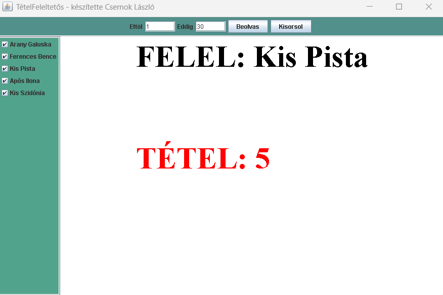

# TetFel

## Magyar leírás

**TetFel** egy egyszerű alkalmazás, amely megkönnyíti a feleltetést: véletlenszerűen kisorsolja, hogy az egyes diákok mely tételből felelnek. Az alkalmazást gimnáziumi éveim alatt készítettem, az érettségire való felkészülés támogatására.

### Funkciók
- Diákok véletlenszerű kiválasztása
- Tételszám-tartomány megadása
- Egyéni névsor betöltése
- Alapértelmezett névsor kezelése fájlból

### Használat
- Az oldalsó menüben kiválasztható, hogy a program mely diákok közül sorsoljon (alapértelmezés szerint mindenki ki van jelölve).
- A felső részen megadható a tételszámok intervalluma, amelyből az adott diák tételt kaphat.
- Induláskor a program a `nev.txt` fájlból olvassa be a neveket.
- Egyéni névsor a **Beolvas** gombbal tölthető be.


---

## English Description

**TetFel** is a simple application designed to make oral examinations easier by randomly assigning students to exam topics. I created this application during my high school years to support teachers in preparing students for final exams.

### Features
- Random selection of students
- Configurable topic number range
- Custom student list loading
- Default name list loaded from file

### Usage
- In the side menu, you can select which students the program should draw from (by default, all students are selected).
- At the top, you can define the topic number interval from which a student may receive a topic.
- On startup, the program loads student names from the `nev.txt` file.
- A custom student list can be loaded by clicking the **Load** button.

### Screenshot/Képernyőkép



---

### Project Structure/Struktúra

```text
TetFel/
├─ screenshots/
│  └─Tetfel1.png
├─ dist
├─ README.md
└─ src/tetfel
